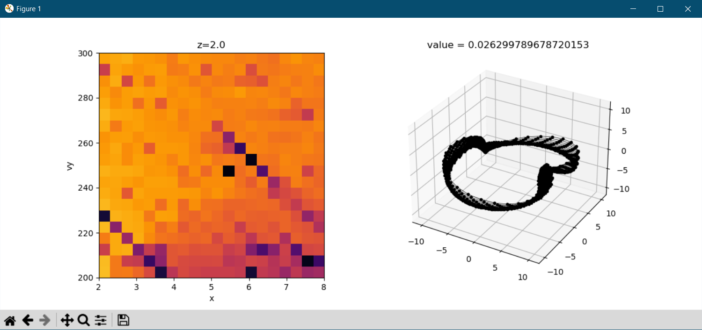
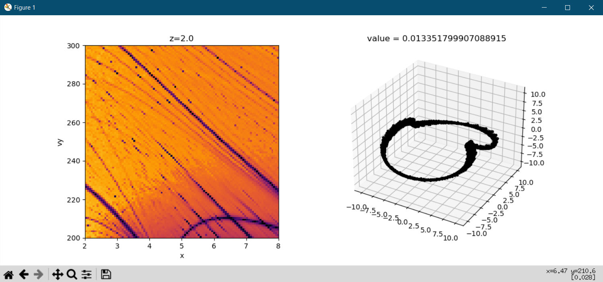

<!-- invisible-code-block: python
try:
    import agama
    AGAMA_AVAILABLE = True
except ModuleNotFoundError:
    AGAMA_AVAILABLE = False

try:
    import gala
    GALA_AVAILABLE = True
except ModuleNotFoundError:
    GALA_AVAILABLE = False

try:
    import galpy
    GALPY_AVAILABLE = True
except ModuleNotFoundError:
    GALPY_AVAILABLE = False

# guarantee that exactly one is used
USE_AGAMA = AGAMA_AVAILABLE
USE_GALA = not AGAMA_AVAILABLE and GALA_AVAILABLE
USE_GALPY = not AGAMA_AVAILABLE and not GALA_AVAILABLE and GALPY_AVAILABLE
RUN = USE_AGAMA or USE_GALA or USE_GALPY
-->

# Commensurability Quickstart

`commensurability` is a package that provides tools for analyzing commensurabilities within galactic potentials. It contains subpackages that implement particular algorithms for evaluating an orbit's commensurability.

### Installation

See [installation](../installation.md) for full installation details.

```
pip install commensurability
```

## Usage

### Galactic Dynamics Setup

This package is compatible with the galactic dynamics packages [`agama`](https://github.com/GalacticDynamics-Oxford/Agama), [`gala`](https://gala-astro.readthedocs.io/en/latest/), and [`galpy`](https://docs.galpy.org/en/latest/). To get started, set up a function that defines and returns a particular galactic potential:

=== "Agama"

    <!-- skip: next if(not USE_AGAMA) -->

    ```python
    def potential_definition():
        import agama

        bar_pot = dict(
            type="Ferrers",
            mass=1e9,
            scaleRadius=1.0,
            axisRatioY=0.5,
            axisratioz=0.4,
            cutoffStrength=2.0,
            patternSpeed=30,
        )
        disk_pot = dict(type="Disk", mass=5e10, scaleRadius=3, scaleHeight=0.4)
        bulge_pot = dict(type="Sersic", mass=1e10, scaleRadius=1, axisRatioZ=0.6)
        halo_pot = dict(type="NFW", mass=1e12, scaleRadius=20, axisRatioZ=0.8)
        pot = agama.Potential(disk_pot, bulge_pot, halo_pot, bar_pot)
        return pot
    ```

=== "Gala"

    <!-- skip: next if(not USE_GALA) -->

    ```python
    import astropy.units as u

    def potential_definition():
        import gala.potential as gp
        from gala.units import galactic

        disk = gp.MiyamotoNagaiPotential(m=6e10 * u.Msun, a=3.5 * u.kpc, b=280 * u.pc, units=galactic)
        halo = gp.NFWPotential(m=6e11 * u.Msun, r_s=20.0 * u.kpc, units=galactic)
        bar = gp.LongMuraliBarPotential(
            m=1e10 * u.Msun,
            a=4 * u.kpc,
            b=0.8 * u.kpc,
            c=0.25 * u.kpc,
            alpha=25 * u.degree,
            units=galactic,
        )
        pot = gp.CCompositePotential()
        pot["disk"] = disk
        pot["halo"] = halo
        pot["bar"] = bar
        return pot
    ```

=== "Galpy"

    <!-- skip: next if(not USE_GALPY) -->

    ```python
    import astropy.units as u

    def potential_definition():
        import galpy.potential as gp

        omega = 30 * u.km / u.s / u.kpc
        halo = gp.NFWPotential(conc=10, mvir=1)
        disc = gp.MiyamotoNagaiPotential(amp=5e10 * u.solMass, a=3 * u.kpc, b=0.1 * u.kpc)
        bar = gp.SoftenedNeedleBarPotential(
            amp=1e9 * u.solMass, a=1.5 * u.kpc, b=0 * u.kpc, c=0.5 * u.kpc, omegab=omega
        )
        pot = [halo, disc, bar]
        gp.turn_physical_on(pot)  # ensure Astropy units support
        return pot
    ```

Why define a separate function? When writing a commensurability analysis object to disk, this function's source is stored along with the generated data. This way, the potential can be reconstructed when reading data back into an analysis object, allowing for continued analysis within the same potential.

After defining a potential, we must define a region of phase space to probe for commensurate orbits.

### Initial Conditions

The region of phase space is specified by two arguments:

- an "initial condition" function that returns a `astropy.coordinates.SkyCoord` object.
- a dictionary of sequences of values to be passed into the "initial condition" function, defining the dimensions of the data to be generated.

Suppose we want to explore orbits starting between 2 and 8 kiloparsecs with an initial tangential velocity between 200 and 300 kilometers per second, starting 2 to 4 kiloparsecs above the galactic plane. A 30x30x5 data cube for this region in phase space can be defined as follows.

<!-- skip: next if(not RUN) -->

```python
import astropy.coordinates as c
import astropy.units as u
import numpy as np

def initial_condition(x, vy, z):
    return c.SkyCoord(
        x=x * u.kpc,
        y=0 * u.kpc,
        z=z * u.kpc,
        v_x=0 * u.km / u.s,
        v_y=vy * u.km / u.s,
        v_z=0 * u.km / u.s,
        frame="galactocentric",
        representation_type="cartesian",
    )

values = dict(
    x=np.linspace(2, 8, 20),
    vy=np.linspace(200, 300, 20),
    z=np.linspace(2, 4, 5),
)
```

Lastly, the simulation parameters must be defined, namely the time step and number of steps.

<!-- skip: next if(not RUN) -->

```python
dt = 0.01 * u.Gyr
steps = 1000
```

### Running Analysis

This region of phase space can be probed for commensurabilities using one of the `Analysis` classes provided in the `commensurability` package.

<!-- skip: next if(not RUN) -->

```python
from commensurability import TessellationAnalysis
```

Collecting everything, we can pass the above objects in the following order:

<!-- skip: next -->

```python
# tessellation needs to know the pattern speed used to define the potential
# so that it can perform its analysis in the co-rotating frame
omega = 30 * u.km / u.s / u.kpc
tanal = TessellationAnalysis(initial_condition, values, potential_definition,
                             dt, steps, pattern_speed=omega)
```

This step will take a while. Once this is done, it is recommended to write the object to disk—the object is fully recoverable from the disk. All analysis objects are stored using the [HDF5](https://www.hdfgroup.org/solutions/hdf5/) format.

<!-- skip: next -->

```python
# to save to disk
tanal.save("example_analysis.hdf5")

# to read from disk
tanal = TessellationAnalysis.read_from_hdf5("example_analysis.hdf5")
```

### Launch an Interactive Plot

Analysis objects can launch interactive plots to explore the generated data. Currently, interactive plots work with up to 3 dimensions of the generated data. Specify two variables for the plotting axes, and optionally specify a third to vary using the scroll wheel. For 3 dimensional data, the scroll wheel varies the remaining variable by default.

<!-- skip: next -->

```python
tanal.launch_interactive_plot("x", "vy")
```

This should launch a window with two plots side by side: the left is a visualization of the commensurability data within phase space, and the right will display integrated orbits. A left-click in the left plot will generate the corresponding orbit from that initial condition. A right-click in the left plot will do the same, but also compute and visualize a commensurability evaluation.



Running this example for a finer grid size produces the following plot:


