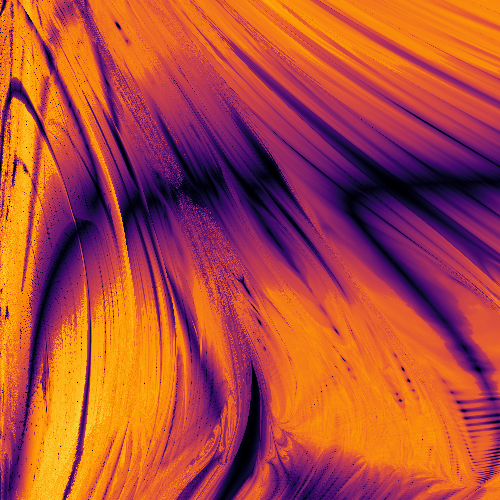

# Home Page for `orbit-tessellation`

[](https://pypi.org/project/orbit-tessellation/)
[](https://pypi.org/project/orbit-tessellation/)

[](https://github.com/ilikecubesnstuff/orbit-tessellation/actions/workflows/tests.yml)
[](https://orbit-tessellation.readthedocs.io/en/latest/?badge=latest)
[](https://pdm.fming.dev)
[](https://github.com/pre-commit/pre-commit)
[](https://github.com/astral-sh/ruff)
[](https://github.com/psf/black)
[](https://pycqa.github.io/isort/)

A Python package for evaluating orbit commensurability using Delaunay tessellation.

This package is used by the [commensurability](https://github.com/ilikecubesnstuff/commensurability) package to analyze commensurabilities in the phase space of galactic potentials.

<figure markdown="span">
  
  <figcaption>Image of a slice of phase space generated by the commensurability package with orbit tessellation. Darker regions correspond with commensurate orbits.</figcaption>
</figure>

This package is available on [PyPI](https://pypi.org/project/orbit-tessellation/).

```
pip install orbit-tessellation
```

If you notice any issues, feel free to raise them on [GitHub](https://github.com/ilikecubesnstuff/orbit-tessellation/issues)!
