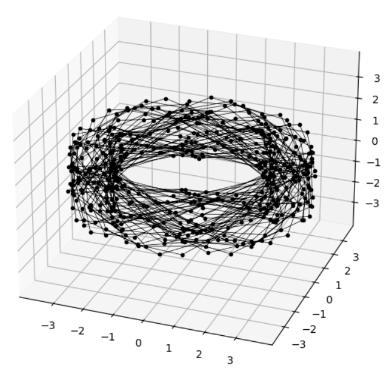

# Motivation

Most orbits in a galaxy will fill a [toroid](https://en.wikipedia.org/wiki/Toroid) fully over time.
A special class of orbits will repeat its tracks and only probe a small sub-volume of the toroid—these orbits are called "commensurate".

Commensurate orbits are closely linked with *resonant* orbits, and these are often probed with the use of frequency analysis tools (such as [superfreq](https://superfreq.readthedocs.io/en/latest/) or [naif](https://naif.readthedocs.io/en/latest/)).
By relying on the stability of an orbit's kinematic frequencies, the fundamental frequencies can be extracted after sufficiently long orbit integration.

Orbit tessellation aims to pick out commensurate orbits with lower orbit integration timescales, as well as pick out commensurabilities in cases where the kinematic frequencies need not stay constant (such as in an evolving potential).

## Resonant Orbits

Orbits are *resonant* if the frequencies of their motion (angular, radial, vertical) become commensurable (in rational proportion).
In 3D, resonances are a phenomenon governed by the equation:

$$ m\Omega_p = n_1\Omega_r + n_2\Omega_\varphi + n_3\Omega_z $$

Resonances are crucial because in a collisionless system, they are the only places where orbits can gain or lose conserved quantities such as energy and angular momentum.
From ["The capture and escape of stars"](https://academic.oup.com/mnras/article/285/1/49/993447):
> Why are the resonant orbits so important?
> Suppose a disturbance rotating at angular frequency $\Omega_p$ is applied to the disc.
> On each traverse, the resonant stars meet the crests and troughs of the perturbation potential at the same spots in their orbits and this causes secular change in the orbital elements.
> The non-resonant stars feel only periodic fluctuations that average to zero.
> As the strength of the perturbation increases, stars near the locus of exact resonance are captured into libration around the parent periodic orbit.
> So, the neighbourhoods of the resonances are the regions of a galaxy where a disturbance can produce long-term effects by changing populations of orbital families.

## Repeated Tracks

Commensurate orbits are those that repeat its tracks over its orbit, probing a relatively small volume in 3D space.
[Petersen, Weinberg & Katz (2020)](https://academic.oup.com/mnras/article/500/1/838/5925365) developed an algorithm to leverage this property for rapid identification of commensurate orbits.
From appendix B1 of ["Using commensurabilities and orbit structure to understand barred galaxy evolution"](https://academic.oup.com/mnras/article/500/1/838/5925365):

> Given a series of samples at discrete times for an orbit, we wish to approximate the area that an orbit would sample in the theoretical limit where the time interval between points in the series goes to zero, $\delta t \to 0$ and the total time integration is very long, $T \to \infty$.
> To measure the area of an annulus or volume of a sphere that a discrete set of orbit time samples would eventually fill as $T \to \infty$, we require a tessellation technique that transforms a discrete time series of points into an integrable area, $\delta t \to 0$.
> One such computational technique is Delaunay triangulation (DT).
> We construct a procedure that uses DT, taking as input a set of points and returning a single value that is the (normalized) computed orbit area from the sum of individual tessellated triangles.

The idea is to tessellate the points and trim sections that are not traversed by the orbit—"unwanted" sections.
Such a tessellation algorithm would cover unwanted sections with polyhedra of large "axis ratios", as they would have to connect unrelated parts of the orbit.

This algorithm is implemented in the `tessellation` subpackage.
The above is used as the trimming criterion—see [tessellation's implementation](tessellation/implementation.md) for more details.
