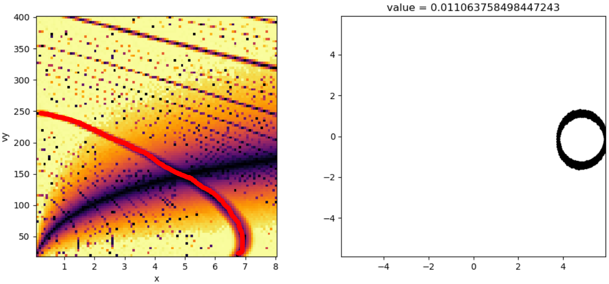

<!-- invisible-code-block: python
AGAMA_AVAILABLE = False
try:
    import agama
    AGAMA_AVAILABLE = True
except ModuleNotFoundError:
    pass

# NOTE: agama potential breaks in latest version, skip even if agama is available
AGAMA_AVAILABLE = False
-->

# Adding a Rotating Bar to a Potential

The following examples will be using [`agama`](https://github.com/GalacticDynamics-Oxford/Agama). These examples will explore the effect of adding a bar on commensurate tracks in an NFW potential.

## Initial Imports

<!-- skip: start if(not AGAMA_AVAILABLE) -->

```python
import astropy.coordinates as c
import astropy.units as u
import numpy as np

from commensurability import TessellationAnalysis2D
```

## NFW Potential Setup

Start by setting up a regular NFW potential in a function. Make sure to include the agama import as part of the function.

```python
def potential_definition():
    import agama

    nfw_pot = dict(type="NFW", mass=1e12, scaleRadius=20, axisRatioZ=0.8)
    potential = agama.Potential(nfw_pot)
    return potential
```

This potential is spherically symmetric. Let's take the x-y plane to be the "galactic plane", and observe how 2D orbits behave over a range of a few kiloparsecs. For this example, the initial positions range from 0.1 to 8 kiloparsecs and the initial velocities range from 20 to 400 kilometers per second. This is done by defining an initial conditions function that takes in `x` and `vy` values, and outputs the corresponding coordinate with a `astropy.coordinates.SkyCoord` object.

```python
def initial_condition(x, vy):
    return c.SkyCoord(
        x=x * u.kpc,
        y=0 * u.kpc,
        z=0 * u.kpc,
        v_x=0 * u.km / u.s,
        v_y=vy * u.km / u.s,
        v_z=0 * u.km / u.s,
        frame="galactocentric",
        representation_type="cartesian",
    )

# define the ranges of input for initial_condition
values = dict(
    x=np.linspace(0.1, 8, 100),
    vy=np.linspace(20, 400, 100),
)
```

Finally, let us set up the integration parameters and run a tessellation analysis on the above.
Later on, we will be introducing a rotating bar with a fixed pattern speed of 30 kilometers per second per kiloparsec.
Orbit commensurabilities will have to be analyzed in the co-rotating frame.
To compare these examples appropriately, we will impose the same co-rotating frame here.

```python
dt = 0.01 * u.Gyr
steps = 500
omega = 30 * u.km / u.s / u.kpc

tanal = TessellationAnalysis2D(
    initial_condition,
    values,
    potential_definition,
    dt,
    steps,
    pattern_speed=omega,
    pidgey_chunksize=500,
    mp_chunksize=20,
)
tanal.save("no_bar_example.hdf5")
```

Note that there are 2 chunksize parameters. `pidgey_chunksize` determines how many orbit calculations are done in a call. Once computed, `mp_chunksize` determines how to chunk the commensurability evaluation over these orbits.

It is recommended to save analysis objects immediately after finishing computation. Analysis objects are saved using the [HDF5](https://www.hdfgroup.org/solutions/hdf5/) format. The analysis object can be recovered entirely from this file, using [`Analysis.read_from_hdf5`](../../../reference/commensurability/analysis.md#commensurability.analysis.AnalysisBase.read_from_hdf5).

```python
# to read from disk
tanal = TessellationAnalysis.read_from_hdf5("no_bar_example.hdf5")
```

## Exploring Orbits

{ width=40% align=right }

Once this step is done, launch the interactive plot to view the structure of the phase space.

<!-- skip: end -->
<!-- skip: next -->

```python
tanal.launch_interactive_plot("x", "vy")
```

This plot shows various "tracks" that correspond with orbits of low commensurability value. Feel free to click around and explore what kind of orbits each track correspond with. Some of the more prominent tracks include:

- circular orbits

- corotating orbits

- orbits resonant with the pattern speed, such as:


## Adding a Bar

We can modify the original potential by adding a bar.

<!-- skip: start if(not AGAMA_AVAILABLE) -->

```python
def potential_definition():
    import agama

    bar_pot = dict(
        type="Ferrers",
        mass=1e9,
        scaleRadius=3.0,
        axisRatioY=0.5,
        axisratioz=0.4,
        cutoffStrength=2.0,
        patternSpeed=30,
    )
    nfw_pot = dict(type="NFW", mass=1e12, scaleRadius=20, axisRatioZ=0.8)
    potential = agama.Potential(nfw_pot, bar_pot)
    return potential
```

The remaining parameters will all be kept the same. The code blocks are omitted from this section since they are identical to before.

```python
tanal = TessellationAnalysis2D(
    initial_condition,
    values,
    potential_definition,
    dt,
    steps,
    pattern_speed=omega,
    pidgey_chunksize=500,
    mp_chunksize=20,
)
tanal.save("bar_example.hdf5")

# to read from disk
tanal = TessellationAnalysis.read_from_hdf5("bar_example.hdf5")
```

{ width=40% align=right }

As before, this step will take some time to run. Once completed, we can launch the interactive plot and observe the differences present in the phase space structure.

<!-- skip: end -->
<!-- skip: next -->

```python
tanal.launch_interactive_plot("x", "vy")
```

The addition of the bar appears to have distorted the commensurate tracks present in the NFW potential alone. Some commensurate tracks appear weaker, like the corotation track, while other regions appear more pronounced:

- triangle orbits

- square orbits


## Adding a Big Bar

To take this to the extreme, we can try adding a very massive bar and observe its effects on the commensurate tracks. Let's recycle the code from the previous section, but increase the bar's mass ten-fold.

<!-- skip: start if(not AGAMA_AVAILABLE) -->

```python
def potential_definition():
    import agama

    bar_pot = dict(
        type="Ferrers",
        mass=1e10,  # more massive!
        scaleRadius=3.0,
        axisRatioY=0.5,
        axisratioz=0.4,
        cutoffStrength=2.0,
        patternSpeed=30,
    )
    nfw_pot = dict(type="NFW", mass=1e12, scaleRadius=20, axisRatioZ=0.8)
    potential = agama.Potential(nfw_pot, bar_pot)
    return potential
```

As before, the remaining parameters will all be kept the same. The code blocks are omitted from this section since they are identical to before.

```python
tanal = TessellationAnalysis2D(
    initial_condition,
    values,
    potential_definition,
    dt,
    steps,
    pattern_speed=omega,
    pidgey_chunksize=500,
    mp_chunksize=20,
)
tanal.save("big_bar_example.hdf5")

# to read from disk
tanal = TessellationAnalysis.read_from_hdf5("big_bar_example.hdf5")
```

{ width=40% align=right }

As before, this step will take some time to run. This may be slightly slower than the previous runs. Launch the interactive plot once completed.

<!-- skip: end -->
<!-- skip: next -->

```python
tanal.launch_interactive_plot("x", "vy")
```

The circular orbit track appears to have been chopped in half! The addition of this bar has caused the circular orbit track to no longer be circular for small orbits:


On top of this, there appear to be even more commensurate pockets to explore here. A few interesting examples include the following:


## Summary

Adding a bar appears to distort the existing commensurate tracks in a potential, weakening some while strengthening others.
Here is a side-by-side comparison of the commensurability images generated for this example.

{ width=32% }
{ width=32% }
{ width=32% }
