# Analysing the Solar Neighborhood

The following example will be using [`galpy`](https://docs.galpy.org/en/latest/). This will explore commensurabilities in the solar neighborhood of a Milky-Way-like galactic potential.

## Initial Imports

```python
import astropy.coordinates as c
import astropy.units as u
import numpy as np

from commensurability import TessellationAnalysis
```

## Setup

Start by setting up a potential definition for the Milky Way. [`galpy`](https://docs.galpy.org/en/latest/) comes with some pre-defined Milky Way potentials—this example uses the `Irrgang13I` definition.

```python
def potential_definition():
    from galpy.potential.mwpotentials import Irrgang13I as potential
    return potential
```

The Sun orbits the Milky Way at approximately 8 kiloparsecs and approximately 240 kilometers per second. The Sun's orbit will be near circular, and should exist within the corresponding commensurate track in phase space. To explore its neighborhood in phase space, we can explore distances in the range 6 to 10 kiloparsecs and velocities in the range 150 to 300 kilometers per second. It would also be interesting to explore any vertical structures in the commensurate tracks, the z-value is varied from 0 to 2 kiloparsecs.

```python
def initial_condition(x, vy, z):
    return c.SkyCoord(
        x=x * u.kpc,
        y=0 * u.kpc,
        z=z * u.kpc,
        v_x=0 * u.km / u.s,
        v_y=vy * u.km / u.s,
        v_z=0 * u.km / u.s,
        frame="galactocentric",
        representation_type="cartesian",
    )

values = dict(
    x=np.linspace(6, 10, 40),
    vy=np.linspace(150, 300, 40),
    z=np.linspace(0, 2, 20),
)
```

Finally, we can set up the simulation parameters and commence the tessellation analysis.

```python
dt = 0.01 * u.Gyr
steps = 500
omega = 50 * u.km / u.s / u.kpc

tanal = TessellationAnalysis(initial_condition, values, potential_definition,
                             dt, steps, pattern_speed=omega, pidgey_chunksize=500, mp_chunksize=20)
tanal.save("sol_neighborhood.hdf5")
```

This step will take quite a while. It is recommended to save analysis objects immediately after finishing computation. Analysis objects are saved using the [HDF5](https://www.hdfgroup.org/solutions/hdf5/) format. The analysis object can be recovered entirely from this file, using [`Analysis.read_from_hdf5`](../../../reference/commensurability/analysis.md#commensurability.analysis.AnalysisBase.read_from_hdf5).

```python
# to read from disk
tanal = TessellationAnalysis.read_from_hdf5("sol_neighborhood.hdf5")
```

## Phase Space

Once the setup is done, we should have a `TessellationAnalysis` object populated with data on the solar neighborhood. The rest of this guide will focus on the interactive plot, which can be launched by doing the following:

<!-- skip: next -->

```python
tanal.launch_interactive_plot("x", "vy")
# plot vy vs x
# z will be controlled by scrolling
```

This opens a window that displays the phase space on the left, and a blank plotting window on the right.

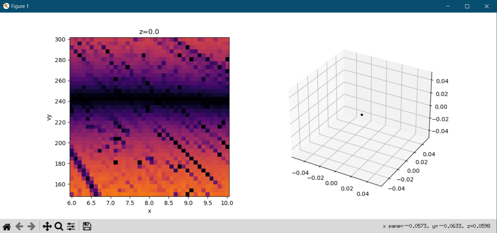{ width=100% }

When a point in phase space is clicked, it is taken as the initial condition for an orbit that is then plotting on the right. However, this is a 3D array of data. To explore the third axis, scroll up and down to vary it—the value is displayed above the left plot. Scrolling reveals a slowly evolving structure of commensurabilities when moving away from the galactic plane.

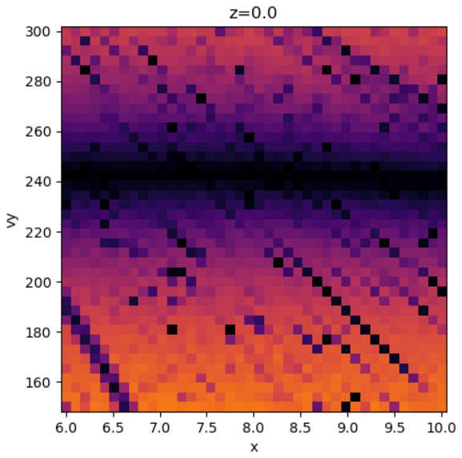{ width=32% }
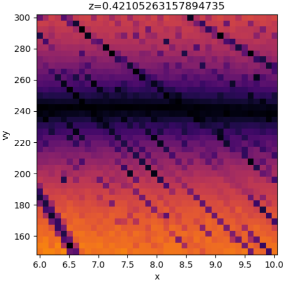{ width=32% }
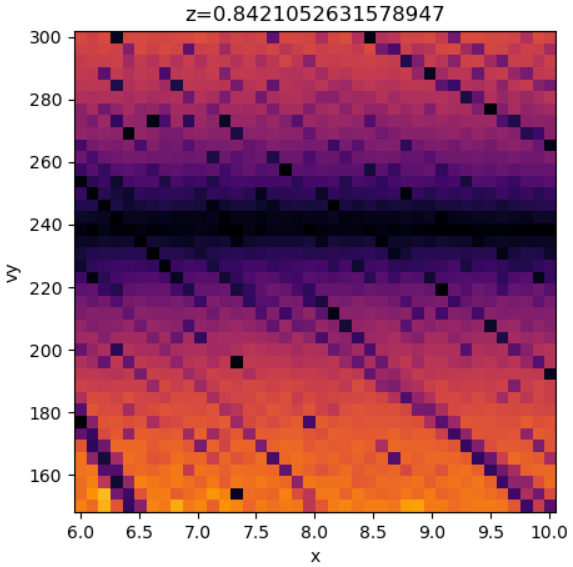{ width=32% }
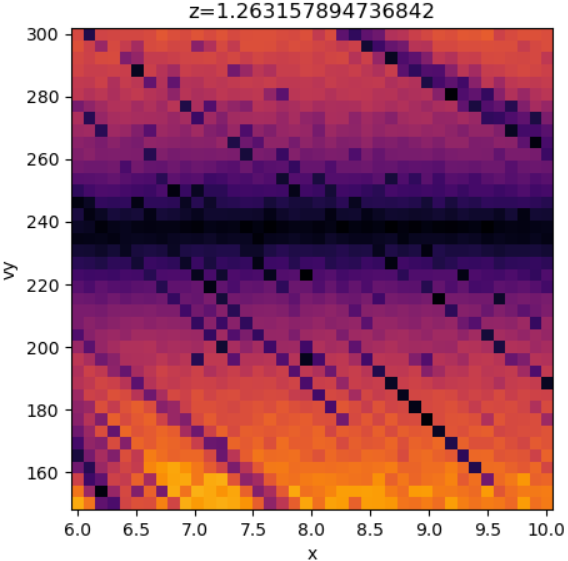{ width=32% }
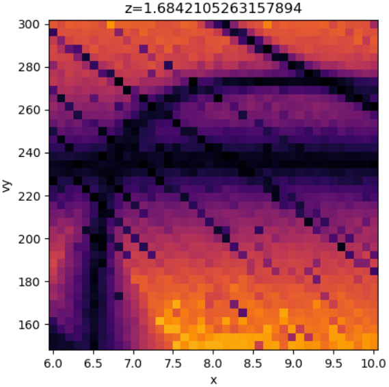{ width=32% }
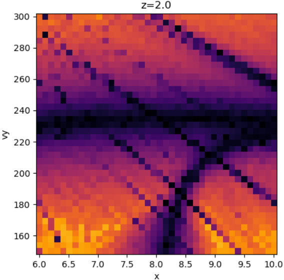{ width=32% }

### In-Plane Resonances

The z=0 plane reveals some structure within the 2D orbits of the galactic plane. The solar orbit lies along the main horizontal line, akin to a rotation curve, corresponding with circular orbits.

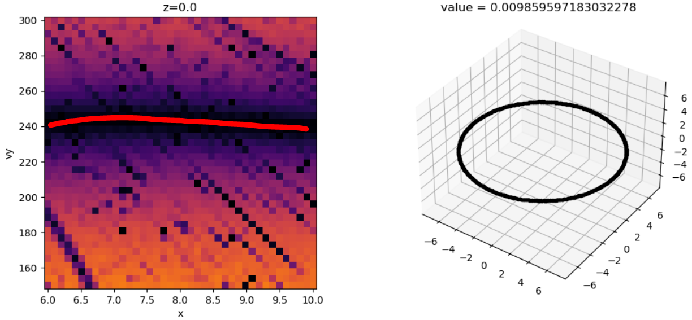

However, this line is crossed by various diagonal commensurate tracks that correspond with resonances related to the pattern speed used here.

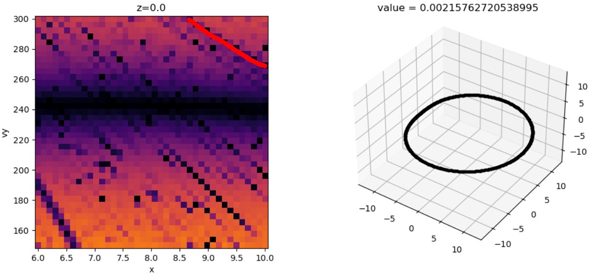
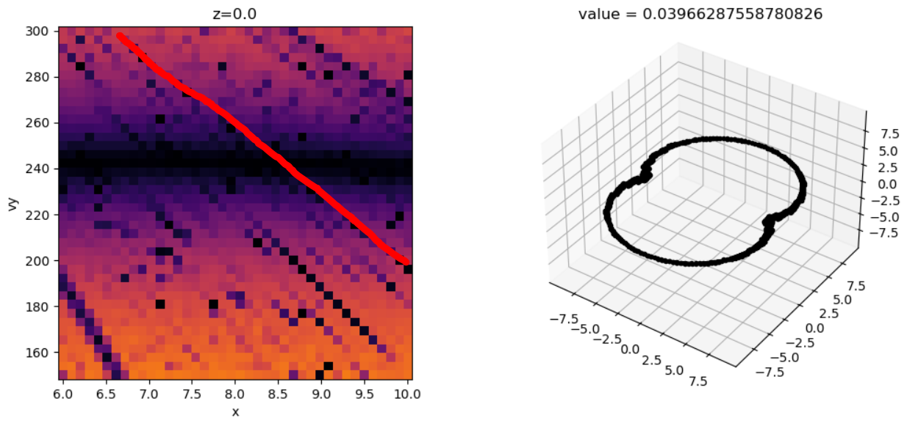
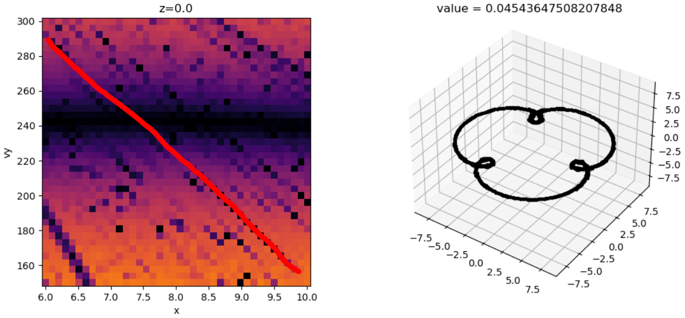

It is also worth noting that co-rotation resonances are just visible in the bottom left corner.

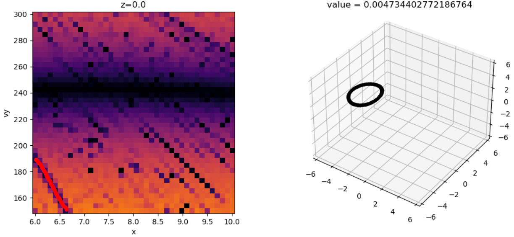

### Bowl Orbits

Close to the z=0 plane, the major commensurate tracks visible do not experience many drastic changes. However, at around z=1.5 to z=2, a new commensurate track appears that sweeps across the phase space window. This track corresponds with orbits that occupy a bowl-shaped region, or bowl orbits.

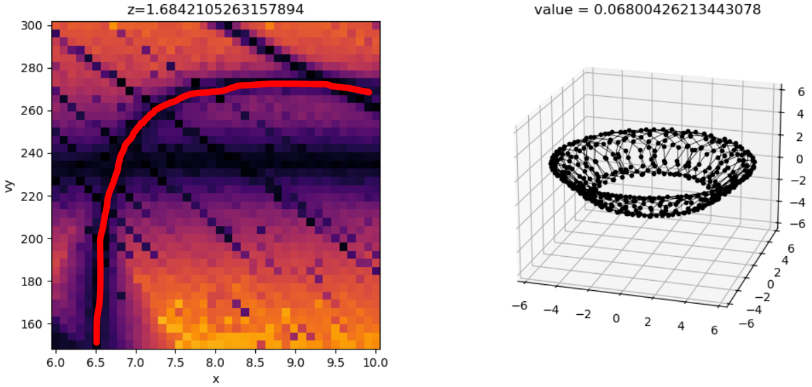

The intersection of the bowl commensurate track with other diagonal commensurate track produce closed orbits.

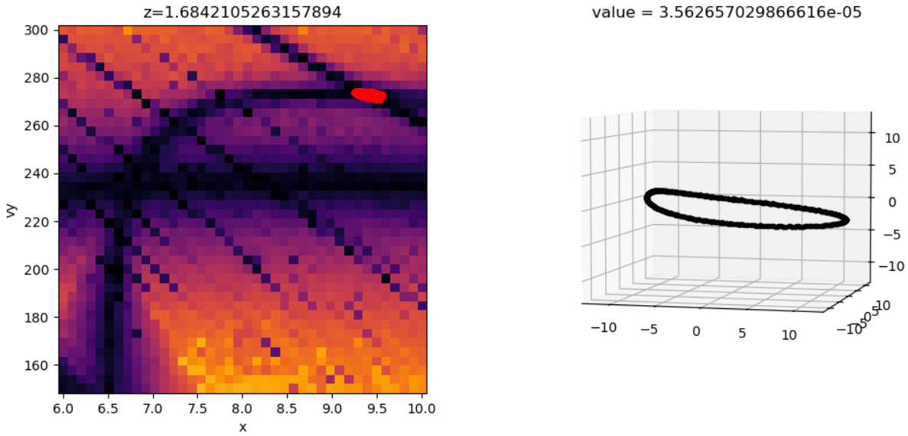
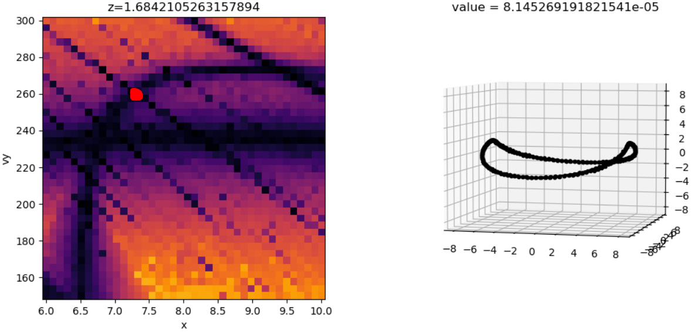
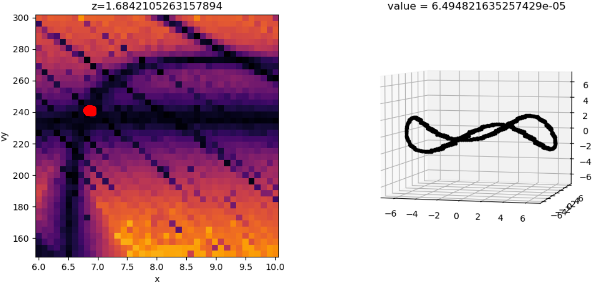


### Other Orbits

There is a weaker commensurate track visible closer to the galactic plane that appears to sweep left until about z=1.4. This track corresponds with rosettes that have similar vertical and epicyclic frequencies, such that their epicycles appear slanted.

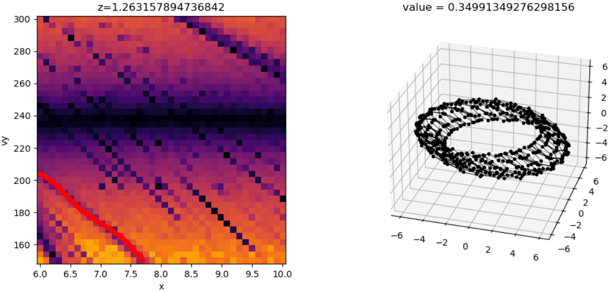

Like with bowl orbits, the slant commensurate track intersects with other commensurate tracks, giving rise to closed orbits.

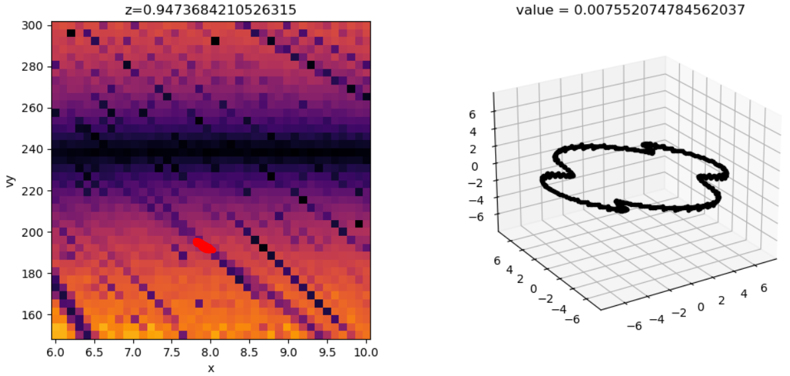
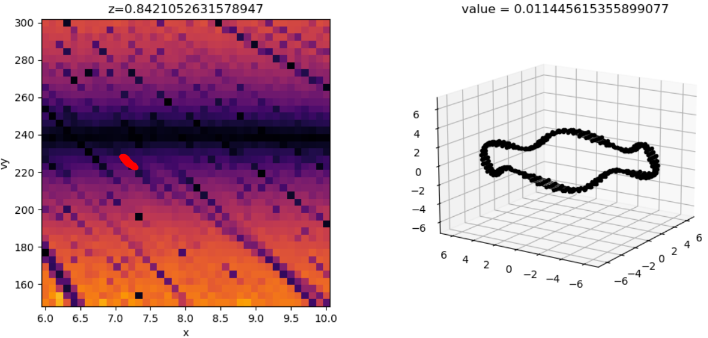

However, these closed orbits are much weaker resonances than the previously shown orbits.

There is also a track visible corresponding with saddle-shaped orbits, but this track does not prominently intersect with other commensurate tracks within the region of phase space explored here.

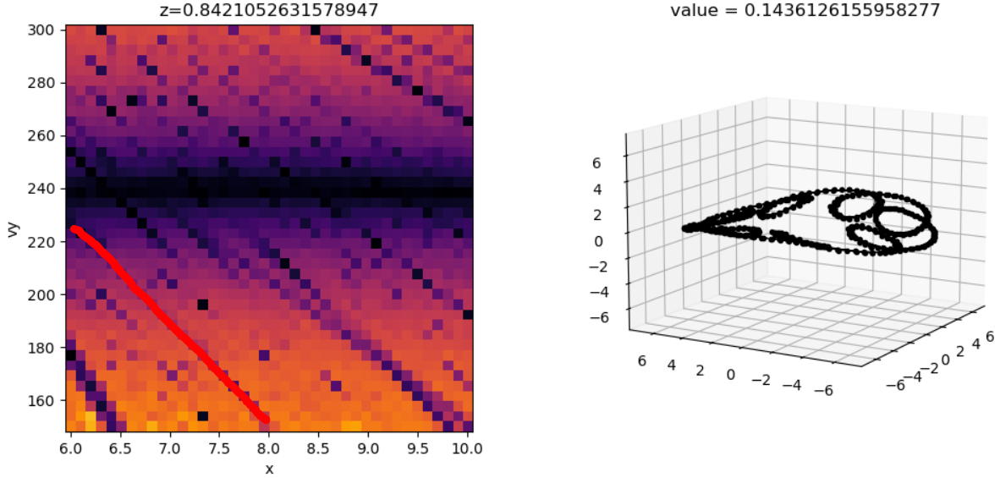
