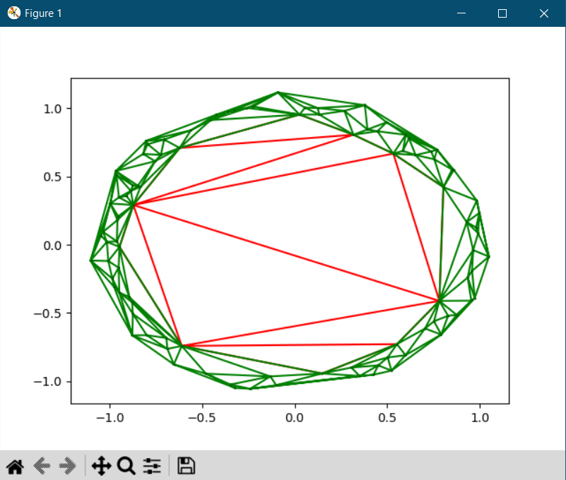
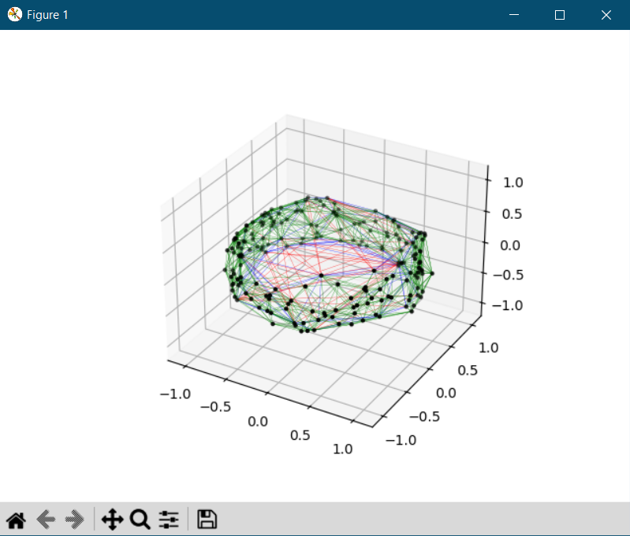

<!-- invisible-code-block: python 

-->

# Tessellation Quickstart

To get started, import `commensurability.tessellation.Tessellation` and call it by passing in your point array or orbit object.

<!-- TODO: restructure this page -->
<!-- skip: start -->

```python
from commensurability.tessellation import Tessellation
tess = Tessellation(points_or_orbit)
```

This should create a `Tessellation` object specific to the dimensionality of your points. (For dimensions larger than 3, a generic N-dimensional class is used.)

For more thorough walkthroughs, see the [usage guides](index.md).

## Usage

This example will use `numpy` to create arrays of data. The package also uses `matplotlib` for plotting.

```python
import numpy as np
import matplotlib.pyplot as plt

from commensurability.tessellation import Tessellation
```

### Tessellating Points

[`Tessellation`](../../reference/commensurability/tessellation/constructor.md#commensurability.tessellation.constructor.Tessellation) accepts a point array of shape `(npoints, ndim)` (e.g. 100 two-dimensional points mean a shape of `(100, 2)`).
This is where you may pass in a point array generated from an orbit integration routine.
You may also pass in an orbit object from [`gala`](https://gala-astro.readthedocs.io/en/latest/) or [`galpy`](https://docs.galpy.org/en/latest/).
For demonstration, a random set of points will be generated here.

=== "2D Example"

    ```python
    # sample points around a circle
    rng = np.random.default_rng(0)
    theta = rng.uniform(-np.pi, np.pi, 100)
    points = np.transpose([np.cos(theta), np.sin(theta)])

    # add random noise
    points += rng.normal(0, 0.05, points.shape)
    ```

=== "3D Example"

    ```python
    # sample points near the equator of a sphere
    rng = np.random.default_rng(0)
    phi = rng.uniform(-np.pi, np.pi, 200)
    theta = rng.uniform(-np.pi/8, np.pi/8, 200)
    points = np.transpose([
        np.cos(theta) * np.cos(phi),
        np.cos(theta) * np.sin(phi),
        np.sin(theta),
    ])

    # add random noise
    points += rng.normal(0, 0.05, points.shape)
    ```

!!! warning "Degeneracy"
    The Delaunay triangulation fails when the point set is degenerate or co-spherical.
    The above example would fail if no random noise was added.

This random point set can then be passed into [`Tessellation`](../../reference/commensurability/tessellation/constructor.md#commensurability.tessellation.constructor.Tessellation).

```python
tess = Tessellation(points)
```

This returns an object with four attributes of note:

- `tess.measure`: The normalized commensurability value normalized between 0 and 1.
    - In 2 dimensional tessellations, [`tess.area`](../../reference/commensurability/tessellation/dim2.md#commensurability.tessellation.dim2.Tessellation2D.area) is an alias for `tess.measure`.
    - In 3 dimensional tessellations, [`tess.volume`](../../reference/commensurability/tessellation/dim3.md#commensurability.tessellation.dim3.Tessellation3D.volume) is an alias for `tess.measure`.
- `tess.points`: The original point set passed in during initialization.
- `tess.tri`: The object returned by [`scipy.spatial.Delaunay`](https://docs.scipy.org/doc/scipy/reference/generated/scipy.spatial.Delaunay.html#scipy-spatial-delaunay).
- `tess.mask`: The boolean mask generated by the trimming algorithm across the tessellation—the corresponding simplices are stored in `tess.tri.simplices`.

!!! note "Failed Triangulations"
    If the point set is degenerate or co-spherical,

    - `tess.tri` will be set to a [`FailedDelaunay`](../../reference/commensurability/tessellation/base.md#commensurability.tessellation.base.FailedDelaunay) instance.
    - `tess.mask` will be set to `None`.
    - `tess.measure` will be set to `0.0`.

<!-- skip: end -->

### Plotting Simplices

For 2 and 3 dimensional tessellations specifically, you can display a plot of the tessellation using [`tess.plot()`](../../reference/commensurability/tessellation/base.md#commensurability.tessellation.base.TessellationBase.plot).

=== "2D Example"

    <!-- TODO: make a testable example -->
    <!-- skip: next -->

    ```python
    fig, ax = plt.subplots()
    tess.plot(ax, plot_included=True, plot_removed=True, plot_points=True)
    plt.show()
    ```

    

=== "3D Example"

    <!-- TODO: make a testable example -->
    <!-- skip: next -->

    ```python
    fig, ax = plt.subplots(subplot_kw={"projection": "3d"})
    tess.plot(ax, plot_included=True, plot_removed=True, plot_points=True)
    plt.show()
    ```

    
