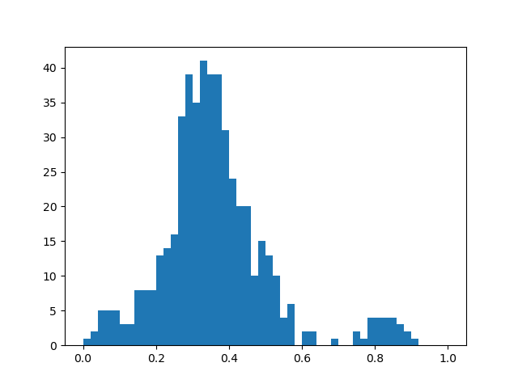
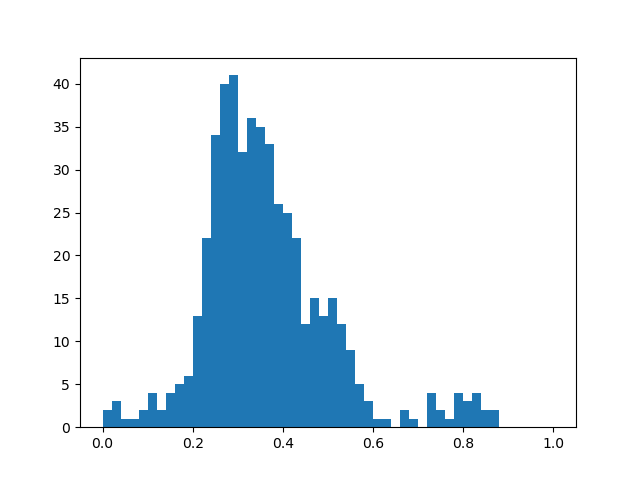
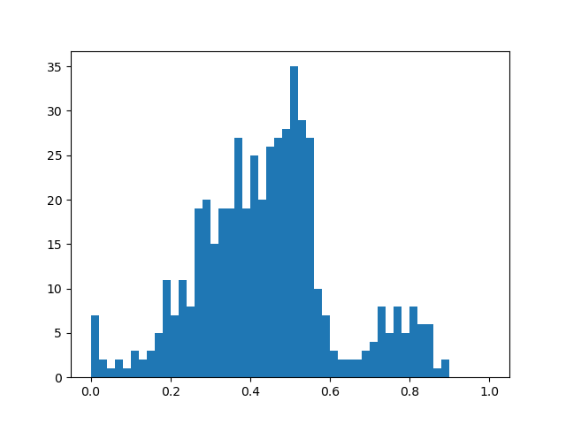

# Using Multiprocessing

This tutoral is similar to [Milky Way Orbit](mw_orbit.md) and [Using Pidgey](pidgey.md).
It uses [`pidgey`](https://github.com/ilikecubesnstuff/pidgey) to streamline the interface to the galactic dynamics packages.
However, this will explore executing these routines on multiple orbits at once using Python's [multiprocessing](https://docs.python.org/3/library/multiprocessing.html) module.

```
from multiprocessing import Pool

from tessellation import Tessellation
```

Define a Milky Way potential with your package of choice.
Initialize the corresponding backend with `pidgey`.

=== "Agama"

    ``` py
    import pidgey
    backend = pidgey.AgamaBackend()

    import agama
    agama.setUnits(length=1, mass=1, velocity=1)  # 1 kpc, 1 Msun, 1 km/s

    from example_mw_bar_potential_new import makePotentialModel
    potential = makePotentialModel()
    ```

    !!! note "Potential Definition"
        This example imports the Milky Way potential definition from [here](https://github.com/GalacticDynamics-Oxford/Agama/blob/master/py/example_mw_bar_potential_new.py).

=== "Gala"

    ``` py
    import pidgey
    backend = pidgey.GalaBackend()

    import gala.potential as gp
    potential = gp.MilkyWayPotential()
    ```

=== "Galpy"

    ``` py
    import pidgey
    backend = pidgey.GalpyBackend()

    from galpy.potential import MWPotential2014
    potential = MWPotential2014
    ```

Define initial conditions using [`astropy`](https://www.astropy.org/) and perform the orbit integration routine.
Here a list of $N=500$ orbits is defined.

``` py
import astropy.coordinates as c
import astropy.units as u

N = 500
rng = np.random.default_rng(0)
ics = c.SkyCoord(
    z = rng.normal(0, 1, N) * u.kpc,
    x = rng.normal(8, 1, N) * u.kpc,
    y = rng.normal(0, 1, N) * u.kpc,
    v_x = np.zeros(N) * u.km/u.s,
    v_y = 250 * np.ones(N) * u.km/u.s,
    v_z = np.zeros(N) * u.km/u.s,
    frame="galactocentric",
    representation_type="cartesian",
)
orbits = backend.compute_orbit(ics, potential, 0.01 * u.Gyr, 200)
```

[`agama`](https://github.com/GalacticDynamics-Oxford/Agama), [`gala`](https://gala-astro.readthedocs.io/en/latest/), and [`galpy`](https://docs.galpy.org/en/latest/) parallelize their orbit integrations when multiple initial conditions are supplied.
To speed up the commensurability evaluation, we can use [`multiprocessing.Pool`](https://docs.python.org/3/library/multiprocessing.html#multiprocessing.pool.Pool) (specifically [`multiprocessing.Pool.map`](https://docs.python.org/3/library/multiprocessing.html#multiprocessing.pool.Pool.map)) to parallelize tessellation.
First, we have to define a function to map over all orbit points.

``` py
def evaluate(points):
    return Tessellation(points).measure
```

Then within a `Pool()` context, map `Tessellation` over the orbit points.

``` py
point_sets = orbits.xyz.transpose(1, 2, 0)  # change to shape (norbits, npoints, ndims)
with Pool() as p:
    values = p.map(evaluate, point_sets)
```

After leaving this running, a list of commensurability values should remain.
We can plot a histogram to see their distribution for the chosen area of the phase space:

``` py
import matplotlib.pyplot as plt

plt.hist(values, bins=50, range=(0, 1))
plt.show()
```

=== "Agama"

    

=== "Gala"

    

=== "Galpy"

    
