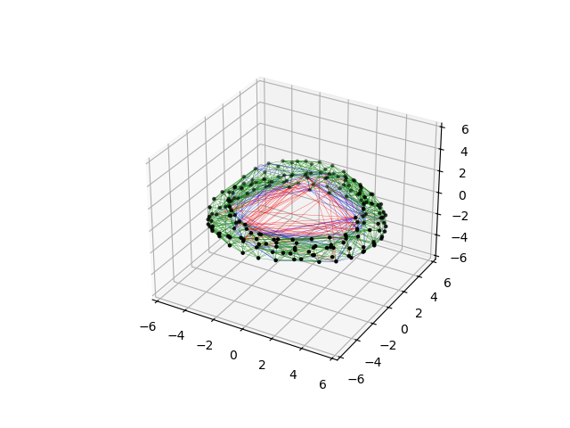
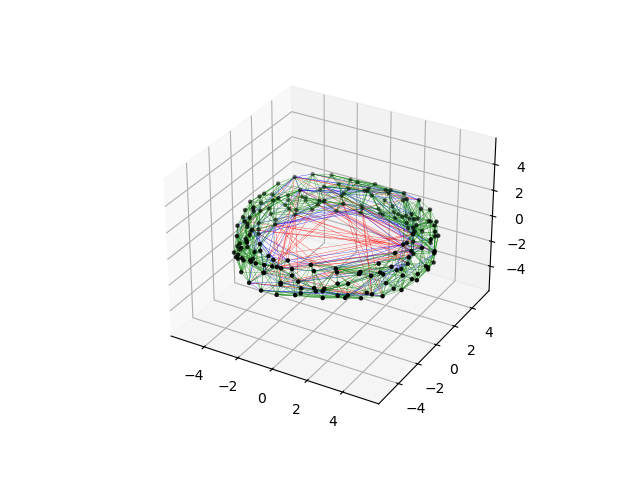

<!-- invisible-code-block: python
try:
    import agama
    AGAMA_AVAILABLE = True
except ModuleNotFoundError:
    AGAMA_AVAILABLE = False

try:
    import gala
    GALA_AVAILABLE = True
except ModuleNotFoundError:
    GALA_AVAILABLE = False

try:
    import galpy
    GALPY_AVAILABLE = True
except ModuleNotFoundError:
    GALPY_AVAILABLE = False

# NOTE: agama potential is not defined in scope, skip even if agama is available
AGAMA_AVAILABLE = False

# guarantee that exactly one is used
USE_AGAMA = AGAMA_AVAILABLE
USE_GALA = not AGAMA_AVAILABLE and GALA_AVAILABLE
USE_GALPY = not AGAMA_AVAILABLE and not GALA_AVAILABLE and GALPY_AVAILABLE
RUN = USE_AGAMA or USE_GALA or USE_GALPY
-->

# Using Pidgey

This tutorial is the same as [Milky Way Orbit](mw_orbit.md).
It uses [`pidgey`](https://github.com/ilikecubesnstuff/pidgey) to streamline the interface to the galactic dynamics packages.

```python
from commensurability.tessellation import Tessellation
```

Define a Milky Way potential with your package of choice.
Initialize the corresponding backend with `pidgey`.

=== "Agama"

    <!-- skip: next if(not USE_AGAMA) -->

    ```python
    import pidgey
    backend = pidgey.AgamaBackend()

    import agama
    agama.setUnits(length=1, mass=1, velocity=1)  # 1 kpc, 1 Msun, 1 km/s

    from example_mw_bar_potential_new import makePotentialModel
    potential = makePotentialModel()
    ```

    !!! note "Potential Definition"
        This example imports the Milky Way potential definition from [here](https://github.com/GalacticDynamics-Oxford/Agama/blob/master/py/example_mw_bar_potential_new.py).

=== "Gala"

    <!-- skip: next if(not USE_GALA) -->

    ```python
    import pidgey
    backend = pidgey.GalaBackend()

    import gala.potential as gp
    potential = gp.MilkyWayPotential()
    ```

=== "Galpy"

    <!-- skip: next if(not USE_GALPY) -->

    ```python
    import pidgey
    backend = pidgey.GalpyBackend()

    from galpy.potential import MWPotential2014
    potential = MWPotential2014
    ```

Define initial conditions using [`astropy`](https://www.astropy.org/) and perform the orbit integration routine.

<!-- skip: next if(not RUN) -->

```python
import astropy.coordinates as c
import astropy.units as u

ics = c.SkyCoord(
    x = 4 * u.kpc,
    y = 0 * u.kpc,
    z = 1 * u.kpc,
    v_x = 0 * u.km/u.s,
    v_y = 250 * u.km/u.s,
    v_z = 0 * u.km/u.s,
    frame="galactocentric",
    representation_type="cartesian",
)
coords = backend.compute_orbit(ics, potential, 0.005 * u.Gyr, 200)
```

Extract the orbit points and plug them into `Tessellation`.

<!-- skip: next if(not RUN) -->

```python
# extract points from SkyCoord object
points = coords.xyz.T
tess = Tessellation(points)
```

The tessellation can then be plotted.

<!-- skip: next -->

```python
tess.plot(plot_removed=True)
```

=== "Agama"

    

=== "Gala"

    

=== "Galpy"

    
